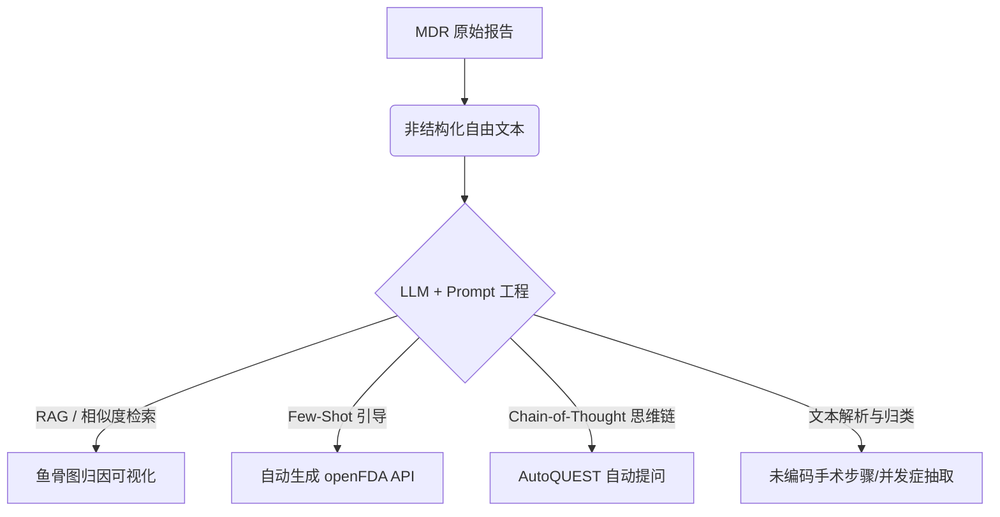

# FDA MAUDE 数据库文献研究方向聚类分析报告

## 一、 核心逻辑与结论摘要

通过对过去 10 年间（2016-2026年）发表在 PubMed 上的 **41 篇**关于 FDA MAUDE（制造商和用户设施器械体验）数据库挖掘文献的深入分析，我们得出以下核心结论：

*   **技术路线演进明显**：研究方法经历了从早期的“基于关键词的产品代码统计挖掘”向“基于 BERT/深度学习的事件严重度分类”，再到最新的“基于大语言模型（LLMs）的语义信息抽取与生成式安全问答”的跨越。
*   **四大核心研究聚类**：这 41 篇论文的研究方向可以清晰地聚类为四大主题：
    1.  **大语言模型（LLM）驱动的非结构化叙述文本智能挖掘与 ETL 自动化**（2024-2026 前沿）；
    2.  **传统 NLP 与机器学习驱动的不良事件自动分类与召回率早期预警**（传统核心）；
    3.  **被动监管数据库的系统性偏差审计与死亡事件误分类纠偏**（数据质量治理）；
    4.  **特定高风险器械的真实世界证据（RWE）对比与临床安全/财务冲击评估**（应用落地）。

---

## 二、 深度聚类拆解分析

### 聚类一：大语言模型（LLM）驱动的非结构化叙述文本智能挖掘与流程自动化
该聚类代表了 2024 至 2026 年间 MAUDE 数据库研究的最前沿。随着 GPT-4 等通用生成式 AI 模型的崛起，研究者开始攻克 MAUDE 数据库中最难处理的“自由文本叙述（Narrative sections）”暗数据。



*   **核心技术路线：**
    *   **ETL-LLM 混合架构**：通过 openFDA API 和传统的 ETL 数据清洗流水线，对数据进行格式化，再利用 GPT-4-turbo 等模型读取医生和患者撰写的非结构化文字，进行结构化字段提取。
    *   **思维链（Chain-of-Thought, CoT）推理**：如 `AutoQUEST` (PMID: 40775892)，利用 CoT 自动编写提示词（Prompt），代替人工完成研究问题的生成和 SQL / API 查询的自动构造与执行。
    *   **向量数据库与语义检索**：利用向量数据库对不良事件进行相似度匹配，并采用鱼骨图（Ishikawa diagrams）将导致不良事件的原因（如操作失误、器械故障、环境因素）进行因果可视化 (PMID: 39049270)。
    *   **生成式 AI 问答机器人**：构建基于自然语言的 Chatbot (PMID: 39176609)，用户使用口语化提问即可自动转换为 API URL，极大地降低了医学研究者探索 MAUDE 数据的技术门槛。
*   **典型应用场景：**
    *   快速分类新型直肠水凝胶间隔物置入术等新兴疗法的不良事件特征；
    *   从叙述性病志中“淘金”提取未被官方数据库编码的并发症和隐性临床操作步骤。
*   **支撑文献：**
    *   Kesharwani 等, 2026 (*Stud Health Technol Inform*, PMID: 42174919)
    *   Sohoni 等, 2026 (*Urology*, PMID: 41565161)
    *   Hua & Gong, 2025 (*Stud Health Technol Inform*, PMID: 40775892)
    *   Shi 等, 2025 (*Stud Health Technol Inform*, PMID: 40200473)
    *   Yu & Gong, 2024 (*Stud Health Technol Inform*, PMID: 39176609)

---

### 聚类二：传统 NLP 与机器学习驱动的不良事件自动分类与召回预测
此聚类占据了文献总量的大多数（约 29 篇），主要通过微调（Fine-Tuning）预训练语言模型（如 BERT 家族）或使用集成学习，对器械安全等级及分类进行预测。

*   **核心技术路线：**
    *   **监督式 NLP 与分类器**：利用 SVM（支持向量机）、Random Forest（随机森林）、LSTM 及 XGBoost，基于 TF-IDF 或 Word2Vec 词向量特征进行分类。
    *   **预训练医学语言模型**：使用 ClinicalBERT (PMID: 37954315) 等针对医疗领域专门微调过的语言模型，自动捕捉不良事件中临床医学术语的上下文关系。
    *   **预测与回归模型**：构建召回率预测系统，结合 Google 趋势和 PubMed 的外部检索特征库，通过随机森林回归模型提前 3 到 12 个月预测 FDA 的器械召回行为 (PMID: 39918157)。
*   **典型应用场景：**
    *   **健康信息技术（Health IT）事件监测**：自动识别由软件交互、数据库错误、参数设定失效导致的 Health IT 医疗事故并将其成库 (PMID: 32916305)。
    *   **ML/AI 医疗器械本身的安全治理**：通过分层文本分类器监测市场上新兴的机器学习诊断算法（如影像辅助诊断软件）出现的异常偏离或失效模式。
*   **支撑文献：**
    *   Merdović 等, 2025 (*Technol Health Care*, PMID: 40105162)
    *   Barbosa Slivinskis 等, 2025 (*West J Emerg Med*, PMID: 39918157)
    *   Wang & Coiera, 2024 (*Stud Health Technol Inform*, PMID: 38269880)
    *   Luschi & Iadanza, 2023 (*Heliyon*, PMID: 37954315)
    *   Lyell 等, 2023 (*JAMIA*, PMID: 37071804)

---

### 聚类三：被动监管数据库的系统性偏差审计与死亡事件误分类纠偏
由于 MAUDE 数据库是一个被动上报系统（Spontaneous Reporting System），数据存在严重的漏报、错报和术语不一致性。该聚类专注于通过数据挖掘来诊断和纠正这些系统性缺陷。

*   **研究核心发现：**
    *   **严重的不良事件分类“漂移”**：JAMA Intern Med 上发表的里程碑式研究 (PMID: 34309624) 指出，有高达 **47.9%** 的包含患者死亡描述的报告，在提交时被记者分类为了“受伤”、“器械故障”或“其他”。通过 NLP 对叙述文本进行扫描审计，证实**真正的死亡事件漏报/误分类率高达 17% - 23%**。
    *   **信息缺失与溯源受阻**：在诸如输尿管软镜等不良事件中，有 **48%** 的报告由于叙事部分过于简略而无法识别其物理失效模式 (PMID: 42159167)；另外只有少于 30% 的损坏设备被医生退还给厂家进行根本原因分析 (PMID: 38110358)，这极大限制了安全回路的闭环。
*   **支撑文献：**
    *   Akhmetov 等, 2026 (*J Endourol*, PMID: 42159167)
    *   Lalani & Redberg, 2021 (*JAMA Intern Med*, PMID: 34309624)
    *   Ahrari & Rajan, 2025 (*J Endovasc Ther*, PMID: 38110358)

---

### 聚类四：特定高风险器械的真实世界证据（RWE）对比与临床/财务冲击评估
这是数据挖掘在医疗管理和临床决策中的直接应用。研究者建立特定的并发症分类标准（如 Clavien-Dindo、Gupta 分级或 CIRSE 标准），对特定技术或器械在真实世界中的表现进行量化对决。

*   **核心研究发现：**
    *   **手术机器人的“经济虚无性”**：Schneider 等 (PMID: 40628307) 对 1,346 起机器人脊柱手术不良事件的横断面数据挖掘显示，不良事件平均会导致手术延误 **58.1 分钟**。利用 189 种 OR（手术室）财务财务模型进行仿真，证明在当前器械故障率下，医院几乎无法在机器人 7 年的折旧期内实现成本回收。
    *   **关键材料设计缺陷**：全踝关节置换（TAR）中，对 3114 起聚乙烯磨损翻修事件的文本挖掘表明，移动平台（MB）的机械断裂发生率（11.3%）远超固定平台（FB）（0.2%），直接推动了骨科材料的进化 (PMID: 36461676)。
    *   **临床干预指征评估**：如对连续血糖监测仪（CGM）的安全评估 (PMID: 28540756)，发掘出超过 25,000 例因失准导致的投诉，直接警告了放弃指尖血确认对非辅助给药带来的潜在临床灾难。
*   **支撑文献：**
    *   Gurnani & Kaur, 2025 (*Expert Rev Med Devices*, PMID: 41123186)
    *   Schneider & Lo, 2026 (*Spine J*, PMID: 40628307)
    *   Jiang & Randsborg, 2023 (*Foot Ankle Int*, PMID: 36461676)
    *   Shapiro, 2017 (*J Diabetes Sci Technol*, PMID: 28540756)

---

## 三、 MAUDE 数据挖掘技术演进图谱与未来展望

### 1. 技术演进图谱
通过文献分析，技术手段呈现出清晰的三代进化轨迹：

```
第一代 (2016-2018)          第二代 (2019-2023)          第三代 (2024-2026)
  关键词检索 +              统计建模 + 经典 NLP         LLM 语义注入 + RAG
 简单 Product Code           (ClinicalBERT, LSTM)      (GPT-4o, Thought CoT)
        │                           │                           │
        ▼                           ▼                           ▼
[高噪声、低重现率]           [能解决分类, 无法推理]       [自动 ETL 管道与因果归因]
```

### 2. 当前面临的科学瓶颈
*   **被动上报数据本身的劣质性**：临床叙述文本高度简略，缺乏一致的报告模版，导致高达 50% 左右的报告无法归入具体失效机理；
*   **缺乏暴露量（分母）**：MAUDE 仅能提供分子数据（报告的不良事件数），若无医院实际使用量的分母数据，难以通过数据挖掘估算出各器械的绝对发生率。

### 3. 未来研究机遇（2026+）
*   **主动多源数据融合监测**：将 MAUDE 数据挖掘技术与国家电子损伤登记库（NEISS）、电子病历（EHR）进行语义匹配，在主动和被动报告库之间搭建数据桥梁；
*   **多模态 LLM 介入**：将大模型应用扩展至多模态，联合医疗器械故障图片（如内镜裂纹、断裂电极图像）与文本描述进行双重验证，实现全自动的“根因溯源”。
