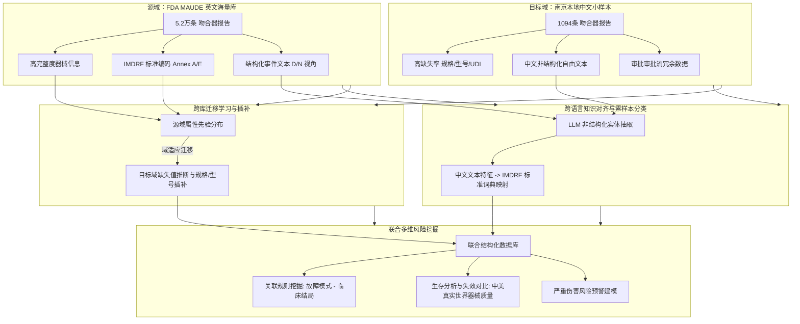

# 论文设计方案：基于大语言模型的吻合器不良事件跨数据库迁移学习与风险信息挖掘研究

本规划方案针对论文题目《基于大语言模型的吻合器不良事件跨数据库迁移学习与风险信息挖掘研究》，设计了完整的科研实验流程与毕业论文章节大纲。该研究方案紧扣“大语言模型 (LLM)”、“跨库迁移学习”和“真实世界数据风险挖掘”三大核心属性。

---

## 一、 核心研究逻辑框架

---

## 二、 实验步骤设计 (Experimental Steps)

### 步骤一：数据治理与联合库建立 (Data Governance)
1. **源域数据规范化**：调用 `maude_stapler_db`，对 `mdr_report`, `device`, `patient`, `foi_text`, `device_problem_code` 表做级联关联，提取特征子集。
2. **目标域去噪清洗**：清除 `吻合器南京.csv` 中所有带 `.1` 的多余列及无关的行政审批日志（如联系方式、审核人姓名等），保留报告时间、器械描述、临床表现、事件经过及调查情况。

### 步骤二：基于 LLM 的跨语言文本实体与故障模式对齐 (LLM-based Cross-lingual Alignment)
1. **Prompt 工程与实体抽取**：构建少样本（Few-shot）提示词，驱动大语言模型（如 Qwen-2.5-72B / GLM-4）对南京数据的 `使用过程` 和 `调查情况` 进行非结构化分析，抽取三大类临床实体：
   - **器械失效行为 (Device Failures)**：如漏发、卡钉、击发无阻力、切割不全等；
   - **患者临床后果 (Clinical Consequences)**：如出血、吻合口漏、组织撕裂、转开腹手术等；
   - **手术背景特征 (Surgical Context)**：如腹腔镜、开腹、肺癌根治术、直肠低位前切除等。
2. **IMDRF 编码跨国映射**：利用 LLM 作为零样本/少样本分类器（Zero-shot Classifier），将抽取的中文实体映射到 FDA 标准的 **IMDRF Annex A（器械故障）** 和 **Annex E（患者损害）** 代码中。

### 步骤三：跨数据库迁移学习与严重缺失值插补 (Cross-DB Transfer Learning & Imputation)
1. **知识先验构建**：在源域（MAUDE）上建立基于图模型或对比表示模型（Contrastive Learning）的模型，掌握“器械品牌 (Brand) - 产品代码 (Product Code) - 通用名 - 故障分类 (IMDRF) - 患者结局”的深层概率关联先验。
2. **跨域插补（Domain Adaptation Imputation）**：
   - 南京数据的 `规格` 缺失 53.7%，`型号` 缺失 23.03%。
   - 将注册证信息与抽取的文本实体输入模型，迁移 MAUDE 的概率矩阵，推断出最可能的器械规格（如 60mm 蓝色钉仓）与型号，实现跨库无监督/半监督补全。

### 步骤四：多维风险信息挖掘与中美双域对比 (Multi-dimensional Risk Mining)
1. **关联规则挖掘 (Association Rule Mining)**：
   - 使用 FP-Growth 算法，挖掘“手术术式 + 吻合器材质/驱动方式 ➔ 核心故障模式 ➔ 患者严重损伤类型”的多级强关联规则。
2. **严重伤害风险分类预测 (Severity Classification)**：
   - 以“是否导致严重伤害/死亡 (Event Type = D/IN)”为标签，提取患者背景、故障模式、使用过程特征，利用 XGBoost / Random Forest 开展特征重要性评估。
3. **中美跨域双盲真实世界生存分析 (Survival Analysis)**：
   - 比较相同制造厂商（如强生、美敦力）在 FDA 监测网络与中国南京监测网络下的不良事件报告周期、常见故障分布及严重度曲线。

---

## 三、 论文章节大纲设计 (Thesis Outline)

### 第一章 绪论
* 1.1 研究背景与医疗监管意义
* 1.2 医疗器械不良事件主动监测的国内外研究现状
* 1.3 吻合器临床失效与风险控制的现实挑战
* 1.4 本文的主要研究内容与研究思路
* 1.5 论文章节组织架构

### 第二章 吻合器不良事件知识域特征与跨库迁移学习框架
* 2.1 真实世界不良事件数据源概述
  * 2.1.1 美国 FDA MAUDE 数据库结构与 IMDRF 标准编码体系
  * 2.1.2 国内地方性监测网络数据特征及质量瓶颈分析
* 2.2 大语言模型在医疗非结构化文本处理中的可行性分析
* 2.3 跨数据库知识迁移与插补的数学表述
* 2.4 本文设计的跨库迁移学习与风险挖掘总体研究框架

### 第三章 基于大语言模型的非结构化不良事件文本标准化与对齐
* 3.1 引言
* 3.2 吻合器失效文本的实体抽取 Prompt 设计与优化
* 3.3 中文非结构化描述向标准 IMDRF Annex A/E 编码映射的 LLM 零样本对齐方法
* 3.4 实体抽取与映射分类的一致性评估与准确率实验
* 3.5 本章小结

### 第四章 面向高缺失率小样本的跨数据库知识迁移与规格插补
* 4.1 引言与问题定义
* 4.2 基于源域概率先验的迁移学习插补模型构建
* 4.3 结合文本表示与注册信息的缺失规格/型号联合推断算法
* 4.4 规格与型号插补效果的定量对照评估实验
* 4.5 本章小结

### 第五章 联合数据库的多维风险信息挖掘与中美真实世界对比研究
* 5.1 引言
* 5.2 联合标准化数据库的建立
* 5.3 故障模式与临床结局的多级关联规则挖掘
* 5.4 基于集成学习的严重伤害预测与特征贡献度分析
* 5.5 中美同类吻合器真实世界失效模式与严重度双域 survival 比较分析
* 5.6 本章小结

### 第六章 吻合器不良事件风险监测与预警系统原型设计
* 6.1 系统需求与架构设计
* 6.2 核心功能模块实现 (LLM 对齐服务、迁移补全服务、可视化风险大盘)
* 6.3 应用场景示范与决策支持分析
* 6.4 本章小结

### 第七章 总结与展望
* 7.1 本文主要研究成果总结
* 7.2 本文研究的创新点
* 7.3 下一步工作与未来展望
