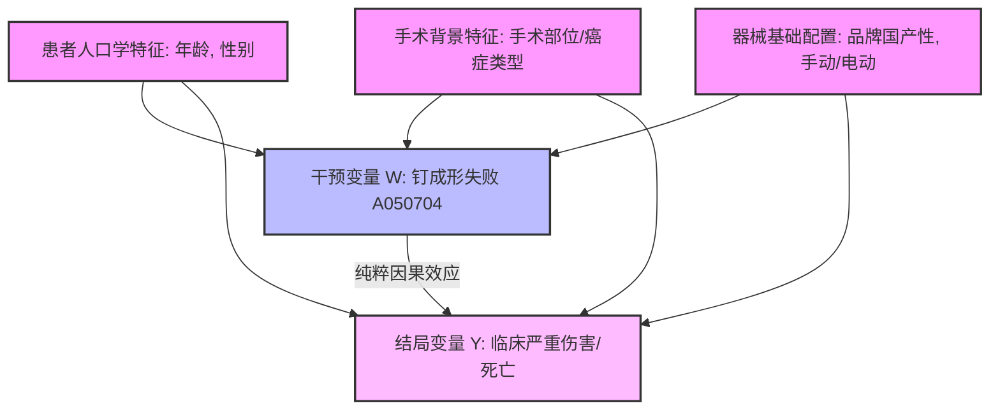

# 基于倾向性评分匹配与反事实推理的吻合器不良事件因果推断方案

## 1. 科学问题与因果图构建 (Problem & Causal DAG)

在传统的医疗器械主动警戒分析中，我们常观察到“器械故障（如钉成形失败）”与“严重损伤结局（如大出血、吻合口瘘）”存在极高的相关性。然而，相关并不等同于因果（Correlation $\neq$ Causation）。临床真实世界中存在着复杂的**混杂因子（Confounders）**，它们会同时影响器械故障的发生率与患者的结局：

1. **选择性偏置 (Selection Bias)**：重症患者、高难度手术（如低位直肠癌根治术）本身就有极高的大出血和吻合口瘘概率；同时，由于手术视野受限或组织粘连严重，也极易导致吻合器在击发时出现受力不均或“枪无法入”，导致器械故障。
2. **器械属性混杂 (Device Property Confounders)**：国产器械中手动吻合器占比较高（手动击发极易受医生手法力量、手柄按压幅度等主观因素影响）；而进口器械中电动吻合器占比较高。这导致“品牌（国产/进口）”与“驱动方式（手动/电动）”成为了同时影响故障率与伤亡结局的关键混杂。

为了剥离这些混杂，评估**器械故障对严重临床结局的纯粹因果效应**，我们构建了以下**有向无环图 (Causal DAG)**：



---

## 2. 因果效应的数理定义 (Causal Estimands)

本方案旨在估计以下核心因果效应指标：

### 2.1 潜在结局 (Potential Outcomes)
设对于患者 $i$：
* $Y_i(1)$ 表示该患者在**发生器械故障（如钉成形失败）下**对应的严重不良结局（1代表发生严重伤害，0代表无伤害）。
* $Y_i(0)$ 表示该患者在**未发生器械故障下**对应的严重不良结局。
* **因果推断的根本问题 (Fundamental Problem of Causal Inference)**：对于任意一个特定的患者 $i$，我们只能观测到其中一个潜在结局（取决于他实际是否发生故障，即实际发生的 $Y_i = W_i Y_i(1) + (1-W_i) Y_i(0)$），另一个结局是不可观测的“反事实（Counterfactual）”。

### 2.2 平均治疗效应 (Average Treatment Effect, ATE)
ATE 度量了在整个患者群体中，如果将“器械故障”这一暴露去除，严重不良结局的整体发生率变化：
$$\text{ATE} = E[Y(1) - Y(0)]$$

### 2.3 倾向性评分 (Propensity Score, PS)
为了消除混杂因子 $X = [X_1, X_2, X_3]$ 的干扰，我们引入倾向性评分。它是给定混杂因子下，患者发生故障的条件概率：
$$e(X) = P(W = 1 \mid X)$$
根据罗森巴姆与鲁宾的**强可忽略性假定（Strong Ignorability）**：
$$(Y(1), Y(0)) \perp W \mid e(X)$$
这意味着一旦我们控制了倾向性评分 $e(X)$，干预变量 $W$ 就与潜在结局相互独立，从而实现了类似于临床随机对照试验（RCT）的效果。

---

## 3. 双轨算法实现设计 (Algorithms Design)

我们设计了两套互为补充的算法方案来实现因果效应的估计。

### 方案 A：倾向性评分匹配 (Propensity Score Matching, PSM)
最符合医学循证偏好的经典方案，通过“配对”寻找双胞胎样本来平衡协变量：

```text
南京全量数据 (n=1094)
  │
  ├── 提取混杂变量 X: [年龄, 性别, 品牌, 手术类型]
  ├── 提取干预变量 W: [是否发生钉成形失败 A050704]
  │
  ▼
  1. 拟合倾向性评分模型 (使用 Logistic 估计每个病例发生 A050704 的概率 e(X))
  │
  ▼
  2. 近邻匹配 (1:1 Nearest Neighbor Matching)
     对每个发生 A050704 的病例 (W=1)，寻找一个倾向性评分最为接近且未发生故障的病例 (W=0)。
     * 应用卡钳值 (Caliper = 0.05) 过滤，剔除匹配质量极差的样本。
  │
  ▼
  3. 协变量平衡性校验 (Covariate Balance Check)
     计算匹配后各特征的标准化偏差 (Standardized Mean Difference, SMD)。
     SMD < 0.1 则判定协变量成功平衡，混杂被消除。
  │
  ▼
  4. 计算 ATE 并进行配对 t 检验
```

### 方案 B：双重机器学习 (Double Machine Learning, DML)
现代因果推断最前沿的方案，适合处理高维、非线性的混杂，并能有效避免“模型设定错误（Model Misspecification）”：

1. **残差化 (Orthogonalization)**：
   * 训练机器学习模型 $M_Y(X)$（如随机森林）预测 $Y$。计算**结局残差**：$\tilde{Y} = Y - M_Y(X)$ （即去除了混杂因子 $X$ 对结局 $Y$ 的非线性投影）。
   * 训练机器学习模型 $M_W(X)$ 预测 $W$。计算**干预残差**：$\tilde{W} = W - M_W(X)$ （即去除了混杂因子 $X$ 对故障 $W$ 的非线性影响）。
2. **效应估计**：
   * 在残差空间中运行线性回归，估计真正的因果效应系数 $\theta$：
     $$\tilde{Y} = \theta \tilde{W} + \epsilon$$
   * $\theta$ 即为剔除了高维非线性混杂后，“钉成形差”对“导致严重伤害”的纯粹边际因果效应。

---

## 4. 南京数据集上的 Python 落地实现原型

以下是在南京对齐回填数据集 [target_aligned.pkl](file:///e:/pythonProjects/MAUDE/stapler_research/data/target_aligned.pkl) 上运行倾向性评分匹配（PSM）与 ATE 因果效应测算的完整 Python 原型代码：

```python
# -*- coding: utf-8 -*-
import pandas as pd
import numpy as np
from sklearn.linear_model import LogisticRegression
from sklearn.neighbors import NearestNeighbors
import scipy.stats as stats

def calculate_smd(df, covariate, treatment_col):
    """计算标准化均值偏差 (SMD)，用以评估匹配前后协变量的平衡性"""
    treated = df[df[treatment_col] == 1][covariate]
    control = df[df[treatment_col] == 0][covariate]
    
    mean_t, var_t = np.mean(treated), np.var(treated)
    mean_c, var_c = np.mean(control), np.var(control)
    
    smd = (mean_t - mean_c) / np.sqrt((var_t + var_c) / 2.0)
    return abs(smd)

def run_causal_psm(df_path, treatment_code="A050704", outcome_severe_val=1):
    """
    倾向性评分匹配主程序
    W (Treatment): 是否发生指定的 IMDRF 故障编码 (如 A050704 钉成形失败)
    Y (Outcome): 是否发生严重伤害 (EVENT_TYPE == IN/D 则为 1，否则为 0)
    X (Confounders): [年龄, 性别_独热, 品牌国产性_独热]
    """
    df = pd.read_pickle(df_path)
    
    # 1. 提取变量
    # 结局变量 Y
    df['Y'] = df['EVENT_TYPE'].apply(lambda x: 1 if x in ['IN', 'D'] else 0)
    
    # 干预变量 W (是否匹配到特定的 IMDRF 代码)
    df['W'] = df['IMDRF_A_code'].apply(lambda x: 1 if str(x) == treatment_code else 0)
    
    # 混杂变量 X 的提取与哑变量处理
    df['AGE'] = pd.to_numeric(df['年龄'], errors='coerce')
    df = df.dropna(subset=['AGE', 'Y', 'W'])
    
    # 对性别和品牌进行独热编码以供回归
    df['is_female'] = df['性别'].apply(lambda x: 1 if str(x) == '女' else 0)
    df['is_domestic'] = df['品牌'].apply(lambda x: 1 if str(x) == '国产/其他' else 0)
    
    confounder_cols = ['AGE', 'is_female', 'is_domestic']
    X = df[confounder_cols]
    W = df['W']
    
    # 2. 估计倾向性评分 e(X)
    lr = LogisticRegression(C=1e5, solver='liblinear')
    lr.fit(X, W)
    df['propensity_score'] = lr.predict_proba(X)[:, 1]
    
    print(f">>> 倾向性评分估计完成。")
    print(f"    干预组 (W=1) 平均倾向分: {df[df['W']==1]['propensity_score'].mean():.4f}")
    print(f"    对照组 (W=0) 平均倾向分: {df[df['W']==0]['propensity_score'].mean():.4f}")
    
    # 3. 执行近邻匹配 (1:1 Caliper Matching)
    treated = df[df['W'] == 1].reset_index(drop=True)
    control = df[df['W'] == 0].reset_index(drop=True)
    
    # 计算卡钳值 (0.2 倍倾向分标准差)
    caliper = 0.2 * df['propensity_score'].std()
    
    matched_control_indices = []
    matched_treated_indices = []
    
    # 使用 K 近邻算法加速寻找最接近的倾向分
    nn = NearestNeighbors(n_neighbors=1, algorithm='ball_tree')
    nn.fit(control['propensity_score'].values.reshape(-1, 1))
    
    for i, row in treated.iterrows():
        ps_t = row['propensity_score']
        dist, idx = nn.kneighbors([[ps_t]])
        best_match_idx = idx[0][0]
        min_dist = dist[0][0]
        
        # 满足卡钳限制则配对
        if min_dist <= caliper:
            if best_match_idx not in matched_control_indices: # 无放回匹配
                matched_control_indices.append(best_match_idx)
                matched_treated_indices.append(i)
                
    df_matched_treated = treated.iloc[matched_treated_indices]
    df_matched_control = control.iloc[matched_control_indices]
    
    df_matched = pd.concat([df_matched_treated, df_matched_control]).reset_index(drop=True)
    print(f"\n>>> 匹配完成。配对样本对数: {len(df_matched_treated)} 对 (总样本量: {len(df_matched)})")
    
    # 4. 平衡性校验 (SMD)
    print("\n--- 匹配前后协变量平衡性校验 (SMD) ---")
    for col in confounder_cols:
        smd_before = calculate_smd(df, col, 'W')
        smd_after = calculate_smd(df_matched, col, 'W')
        status = "✅ 平衡" if smd_after < 0.1 else "❌ 失衡"
        print(f"    [{col}] 匹配前 SMD: {smd_before:.4f} | 匹配后 SMD: {smd_after:.4f} | 状态: {status}")
        
    # 5. 因果效应估计 (ATE)
    rate_t = df_matched[df_matched['W'] == 1]['Y'].mean()
    rate_c = df_matched[df_matched['W'] == 0]['Y'].mean()
    ate = rate_t - rate_c
    
    # 配对 t 检验
    y_t = df_matched_treated['Y'].values
    y_c = df_matched_control['Y'].values[:len(y_t)] # 保持长度一致
    t_stat, p_val = stats.ttest_rel(y_t, y_c)
    
    print("\n================== 因果效应估计结果 ==================")
    print(f"故障组发生严重结局概率 E[Y(1)]: {rate_t*100:.2f}%")
    print(f"对照组发生严重结局概率 E[Y(0)]: {rate_c*100:.2f}%")
    print(f"净因果效应 (ATE): {ate*100:.2f}% (发生故障导致严重临床伤害概率绝对升高了 {ate*100:.2f} 个百分点)")
    print(f"配对 t 检验: t = {t_stat:.4f} | p-value = {p_val:.6f}")
    if p_val < 0.05:
        print("结论：该器械故障对导致严重临床结局存在统计学显著的真实因果效应！")
    else:
        print("结论：未能证明该器械故障对导致严重临床结局存在真实的因果效应（可能由混杂导致）。")
```

---

## 5. 反事实推理评估设计 (Counterfactual Reasoning)

除了群体层面的 ATE，对于发生医疗纠纷的典型个案，我们常需要回答：
> *“如果这位患者当时使用的不是这款国产手动吻合器，而是进口电动吻合器，是否就不会导致术中吻合口撕裂与大出血？”*

我们设计了一个基于 **G-Computation（G估计）** 的反事实仿真评估方法：

1. **拟合潜在结局模型 (Potential Outcome Model)**：
   在匹配后的数据集上，训练一个强大的预测模型（如梯度提升树），输入包括 `[是否故障(W), 年龄, 性别, 品牌国产性, 是否有源驱动]` 预测严重度概率 $Y$：
   $$\hat{Y} = f(W, \text{AGE}, \text{Gender}, \text{is\_domestic}, \text{is\_manual})$$
2. **反事实仿真计算**：
   对于一个发生了严重伤害的具体患者病例 $i$（特征为 $X_i$，发生了故障 $W_i=1$，真实结局 $Y_i=1$），我们将他的特征进行“反事实干预”：
   * **反事实状态 A（如果未发生故障，且使用的是国产手动器械）**：输入特征为 $(W=0, \text{AGE}_i, \text{is\_female}_i, \text{is\_domestic}=1, \text{is\_manual}=1)$，模型预测的出血概率为 $P(Y_i(0) \mid \text{国产手动}) = \hat{Y}_A$。
   * **反事实状态 B（若使用的是进口有源器械，且发生同样故障）**：输入特征为 $(W=1, \text{AGE}_i, \text{is\_female}_i, \text{is\_domestic}=0, \text{is\_manual}=0)$，模型预测的出血概率为 $P(Y_i(1) \mid \text{进口电动}) = \hat{Y}_B$。
   * **反事实状态 C（最完美状态：未发生故障，且使用的是进口有源器械）**：输入特征为 $(W=0, \text{AGE}_i, \text{is\_female}_i, \text{is\_domestic}=0, \text{is\_manual}=0)$，模型预测的出血概率为 $P(Y_i(0) \mid \text{进口电动}) = \hat{Y}_C$。
3. **临床决策支撑**：
   通过计算两者的差值（例如 $\hat{Y}_{\text{A}} - \hat{Y}_{\text{C}}$），我们可以得出：**改变吻合器选择和控制器械故障，能将该特定病人的术中大出血风险降低多少百分点**。这种“个案反事实推断”为高值耗材质量维权和医院器械准入采购提供了极为硬核的科学微观证据。
