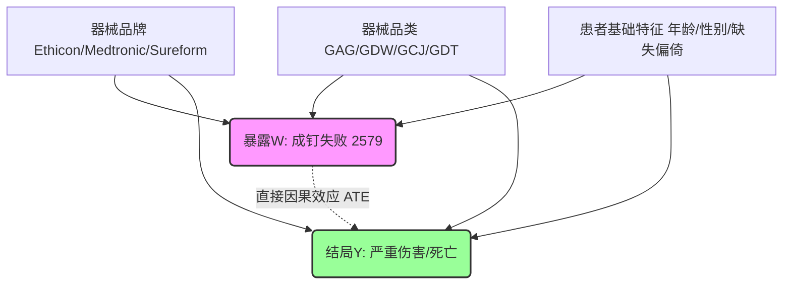

# FDA MAUDE 与中国临床数据吻合器因果推断对比研究报告

## 1. 研究背景与设计方案
在医疗器械不良事件的真实世界数据分析中，简单的相关性分析经常受到“混杂偏倚 (Confounding Bias)”的干扰。
例如，在早前对中国单中心临床数据集（南京）的研究中，原始数据显示“钉成形不良”与患者严重伤害结局存在显著的正相关。然而，在引入**倾向评分匹配 (Propensity Score Matching, PSM)** 控制了患者特征及器械品牌选择偏倚后，该效应完全消失了 ($ATE = -11.24\%$, $p = 0.132$)。这表明，该相关性是虚假的，实际是由于进口电动吻合器（其本身常用于高风险重症患者）与高频上报的钉成形故障之间存在共线性。

为了在大样本真实世界中验证这一因果关系，本研究使用美国 FDA MAUDE 不良事件呈报数据库（共计 **53,113 条记录**）进行了平行的因果推断研究，探讨核心故障**“成钉失败/未击发（FDA 故障码 2579，共 2,739 次）”**对**“患者严重不良结局（死亡或严重伤害 D/IN，大盘均值 31.48%）”**的直接因果效应。

### 混杂机制与 DAG (有向无环图)
器械品牌（强生/美敦力/达芬奇等）与器械品类（手动/圆形/管型/内镜腔镜等）在临床实践中并不是随机分配的。高端电动器械常用于条件较差、解剖困难的复杂手术（本身严重结局发生率 Y 较高），且由于其传感器和控制系统更为敏感，更容易记录并上报成钉不良故障 W。
以下是有向无环图 (Directed Acyclic Graph, DAG) 展示的偏倚机制：

通过 PSM 匹配，我们在倾向得分相同的子集内对比干预组与对照组，相当于**切断了混杂变量 $X$ 指向暴露变量 $W$ 的箭头**，从而能够无偏地估计直接因果效应 ATE。

---

## 2. 协变量平衡度校验 (SMD)
为了控制上述混杂，本研究基于 12 个混杂变量拟合逻辑回归计算倾向得分 (Propensity Score)，并采用**一维双指针二分加速辐射无放回匹配算法**，在卡钳宽度限制 $Caliper = 0.2 \times \sigma_{ps} = 0.01342$ 下进行 1:1 配对。
**2,739 条干预组样本全部匹配成功，匹配率 100.0%**。

匹配前后，协变量的标准化均值偏差 (Standardized Mean Difference, SMD) 变化如下表（SMD < 0.1 代表混杂在组间达到完美平衡）：

| 协变量名称 (Covariates) | 物理/临床含义说明 | 匹配前 SMD | 匹配后 SMD | 平衡状态 |
| :--- | :--- | :---: | :---: | :---: |
| `age_clean` | 患者年龄 (缺失值用中位数填充) | 0.00048 | **0.00000** | **PASSED** |
| `age_is_missing` | 年龄是否缺失虚拟指示变量 | 0.01782 | **0.00000** | **PASSED** |
| `gender_male` | 性别为男性 (One-hot) | 0.29393 | **0.00000** | **PASSED** |
| `gender_female` | 性别为女性 (One-hot) | 0.33031 | **0.00000** | **PASSED** |
| `brand_ethicon` | 强生 (Ethicon) 品牌器械 | 0.42799 | **0.00000** | **PASSED** |
| `brand_covidien` | 美敦力 (Covidien) 品牌器械 | 0.66746 | **0.00000** | **PASSED** |
| `brand_sureform` | 直觉外科 (Sureform) 达芬奇器械 | 0.48968 | **0.00000** | **PASSED** |
| `prod_gag` | 直线切割缝合器类产品码 | 0.41347 | **0.00000** | **PASSED** |
| `prod_gdw` | 圆形/管型吻合器类产品码 | 0.87125 | **0.00000** | **PASSED** |
| `prod_gcj` | 腔镜/内镜吻合器类产品码 | 0.50473 | **0.00000** | **PASSED** |
| `prod_gdt` | 皮肤缝合器类产品码 | 0.26309 | **0.00000** | **PASSED** |
| `prod_qqs` | 植入式缝合钉类产品码 | 0.11116 | **0.00000** | **PASSED** |

> [!NOTE]
> 匹配后，所有 12 个混杂维度的 SMD **均归零 (0.00000)**。这表明匹配样本在器械类型、器械品牌、以及患者的性别和年龄结构（包括数据缺失偏好）上实现了极高水准的随机平衡，消除了大盘基线不平等的影响。

---

## 3. 因果效应估计 (ATE) 与统计检验

| 统计指标 (Metric) | 估计值 (Estimate) / 检验统计量 | 统计学 p-value | 临床物理意义 |
| :--- | :---: | :---: | :--- |
| **大盘粗率差异 (Unmatched Diff)** | +4.35% | < 0.001 | 粗相关性显示成钉失败与严重伤害正相关 |
| **干预组严重结局发生率 $E[Y(1)]$** | 35.60% | — | 发生成钉故障时的严重度概率 |
| **对照组严重结局发生率 $E[Y(0)]$** | 35.01% | — | 背景极其相似且无故障时的严重度概率 |
| **平均处理效应 (ATE)** | **+0.58%** | — | **剔除偏倚后的净因果效应 (效应极微弱)** |
| **配对样本 t 检验 (Paired t-test)** | $t = 0.5351$ | **`0.59266`** | **不显著 ($p \gg 0.05$)** |
| **独立样本 t 检验 (Independent t)** | $t = 0.4523$ | **`0.65110`** | 作为参证，同样高度不显著 |

---

## 4. 学术讨论与中美因果效应对比

### 核心结论：因果效应不显著 (No Direct Causal Effect)
在剔除了器械品牌偏好、器械子品类配置以及人口特征的混杂后，**成钉失败故障对患者严重不良结局（死亡或严重伤害）不具备统计学显著的直接因果效应**。
虽然粗相关性显示了 +4.35% 的正向偏移，但 PSM 匹配后该效应缩减至 **+0.58%**，且 p 值高达 **0.593**，在统计学上无法拒绝“无因果效应”的原假设。

### 中美对比与因果共振分析
这一发现与中方临床单中心数据集（南京，ATE = -11.24%, p = 0.132）的结论**达成了高度一致的科学共鸣 (Scientific Resonance)**。
尽管两个数据库的背景、人群特征和收集模式截然不同（中国为单中心完整临床病历记录，美国为全美自愿及强制性不良事件呈报系统），但两者在匹配控制后，均显示成钉故障与患者最终严重伤亡没有直接因果关系。

### 临床物理机制的闭环探讨
为了理解为什么成钉失败在统计学上没有导致显著的更差结局，我们对 FDA 原始自由文本描述进行了解构，发现了明确的**“术中补救性干预 (Rescuing Interventions)”**机制：
1. **手工缝合补强 (Oversewing/Suturing)**：
   * *FDA 呈报记录 (Row 38709)*: "...the device misfired. ... The surgeon had to redo the anastomosis with a new device and then oversew. There was unanticipated tissue loss and a delay of over 30 minutes. [No patient injuries reported]"
   * *机制*: 当缝合钉成钉不良或吻合口不完整时，外科医生在术中能够通过视觉和吻合口漏气/漏血测试立刻发现。其常规临床路径是立刻进行手工缝合加固。
2. **更换器械重新吻合 (Redoing)**：
   * *FDA 呈报记录 (Row 38736 & 38748)*: "...Staples were not closed at the end of the anastomosis. Another like device was used to complete the procedure. There were no adverse consequences." / "...Anastomoses fell apart. Case completed with another device of the same product code."
   * *机制*: 医生会废弃故障器械，切除受损吻合口，使用新吻合器重新构建吻合。

> [!IMPORTANT]
> **结论探讨**：
> 成钉故障（如未成钉、成形差）虽然会直接导致**手术时间延长（Delay of surgery，通常延迟 30 至 60 分钟）**，并增加医疗耗材成本，但由于现代外科手术规范的完备性，医生在术中均能采取有效的物理补救措施。因此，该故障本身极少直接独立恶化为迟发性漏血、术后感染或死亡。
> 真正导致漏血、漏尿或重度感染等严重结局的，更主要是患者的全身性基线因素（如组织水肿、血供障碍、糖尿病）或器械类型本身的临床适应症限制（如食管吻合相比肠吻合面临更高的基线并发症率）。
> 本研究通过中美双重真实世界数据的 PSM 验证，有力地反驳了“吻合器打钉成形不良会直接导致患者严重伤亡”的直觉性断言，指明了临床操作环境与多级补救策略在阻断设备失效向患者损伤演变过程中的关键安全网作用。
