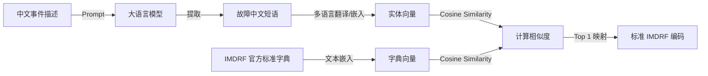

# 吻合器不良事件风险挖掘实验步骤细化方案

本方案针对《基于大语言模型的吻合器不良事件跨数据库迁移学习与风险信息挖掘研究》中的四大实验步骤进行细化，给出具体的算法选择、工程方案及 Prompt 模板设计。

---

## 实验步骤一：数据规范化与联合特征工程 (已完成落地)
* **目标**：完成多表级联与去噪，构建源域与目标域特征视图。
* **物理输出**：生成 `source_standardized.pkl`（5.3万行）与 `target_standardized.pkl`（1094行）。
* **核心清洗规则**：对齐结局口径（`严重伤害`➔`IN`，`死亡`➔`D`，`其他/无`➔`M`），将零散描述字段合并为单一文本自述列。

---

## 实验步骤二：基于 LLM 与语义嵌入的跨语言实体抽取与编码对齐 (LLM-based Alignment)
由于中文不良事件描述缺乏标准的故障编码（IMDRF），我们将采用**“LLM 非结构化实体提取 + 语义嵌入（Embedding）相似度计算”**的混合方案。这能同时解决大语言模型直接分类的“幻觉”问题，保证编码的权威性。



### 1. LLM 实体提取 Prompt 模板设计
使用少样本提示（Few-shot Prompting）从中文文本中提取关键的故障与结局实体：

```text
你是一个医疗器械不良事件分析专家。请仔细阅读以下给出的吻合器不良事件中文描述，并从中提取结构化实体。

【输入文本】
{nanjing_text_combined}

【提取任务】
请严格按照 JSON 格式返回以下三个字段，无需任何解释：
1. "device_failure_phrases": 提取文本中描述的器械故障或异常行为（如“卡钉”、“无法击发”、“切割刀未切断”等，用列表表示，若无则为空）。
2. "patient_consequence_phrases": 提取文本中描述的患者临床后果或伤害表现（如“大出血”、“吻合口漏”、“组织撕裂”等，用列表表示，若无则为空）。
3. "surgical_context_phrases": 提取文本中描述的手术背景信息（如“腹腔镜肺癌根治术”、“直肠切除术”、“开腹”等，用列表表示，若无则为空）。

【输出格式】
{
  "device_failure_phrases": [...],
  "patient_consequence_phrases": [...],
  "surgical_context_phrases": [...]
}
```

### 2. 基于语义嵌入的 IMDRF 标准编码对齐算法
大模型提取出中文短语后，利用中英文对照的 **IMDRF 编码字典表**（`fda_device_problem_mapping`）进行语义对齐：
1. **构建字典向量空间**：使用 `openai/text-embedding-3-small` 或 `text-embedding-v2` 对 IMDRF 字典中的所有英文标准术语（如 "Staple line failure", "Device fire failure"）和对应的官方中文翻译计算嵌入向量（Embedding），存入向量库。
2. **实体向量化**：对大模型提取出的短语（如“无法击发”）计算 Embedding 向量。
3. **相似度匹配**：计算实体向量与字典中所有向量的 **余弦相似度 (Cosine Similarity)**：
   $$\text{Similarity} = \frac{A \cdot B}{\|A\|\|B\|}$$
4. **阈值过滤**：将相似度最高的 IMDRF Code（如 Code 2919）作为该中文记录的对齐编码。设定相似度阈值（如 $\ge 0.75$），若低于该值则人工复核或标记为 "Unknown"。

---

## 实验步骤三：基于跨库迁移学习与先验概率的缺失值插补 (Transfer Learning)
南京数据中，`规格` 缺失率达 53.66%，`型号` 缺失率达 23.03%。为还原完整的器械特征，我们将使用迁移学习从 FDA MAUDE 的知识中进行迁移插补。

### 1. 迁移插补机理
源域（MAUDE）具有高完整度的器械型号（Catalog Number）和规格信息。我们观察到：**“特定的器械品牌 + 临床手术术式 + 提取的故障模式（IMDRF Code）”与“吻合器的规格/钉高”存在极强的条件概率分布**。
例如：直肠低位前切除手术中发生“卡钉”的通常是 29mm 或 33mm 的管型吻合器；而腔镜肺切除手术中通常使用 45mm 或 60mm 的直线切割缝合器。

### 2. 迁移插补算法步骤
1. **知识先验网络训练 (源域)**：
   在 `source_standardized.pkl` 上训练一个**多标签概率分类网络**（如多层感知机 MLP 或 CatBoost）：
   * **输入特征矩阵**：`[BRAND_NAME, EVENT_TYPE, IMDRF_DEVICE_CODE, IMDRF_PATIENT_CODE]`
   * **目标标签**：规格区间（如管型吻合器直径、切割吻合器钉高颜色）与器械子类（如手动管型、有源腔镜）。
   * 训练该映射函数 $f(X_{source}) \rightarrow Y_{specs\_source}$。
2. **对抗域适应训练 (Domain Adaptation)**：
   由于中英文表述和上报偏好的差异，直接套用分类器会有“协变量偏移”。我们在模型中引入**最大均值差异 (MMD, Maximum Mean Discrepancy)** 作为正则项，拉近源域与目标域特征表示在再生核希尔伯特空间（RKHS）中的距离，使模型学到“跨越数据库的域不变特征（Domain-Invariant Features）”。
3. **目标域缺失值推断**：
   将南京数据的 `[品牌, 对齐后的IMDRF代码, EVENT_TYPE]` 输入该域适应插补模型，输出最可能的规格与器械细分品类概率分布，完成补全。

---

## 实验步骤四：联合多维风险信息挖掘与安全预警 (Risk Mining)
在对齐和插补完成后，构建联合标准化数据集，开展多维风险分析。

### 1. 故障-损伤临床多级关联规则挖掘
* **算法选择**：**FP-Growth 算法**（比传统 Apriori 更快）。
* **挖掘变量**：`[器械类型, 驱动方式, 品牌, 对齐后故障模式 (Annex A), 对齐后损害结局 (Annex E)]`。
* **参数设置**：最小支持度 (Min Support) = 0.05，最小置信度 (Min Confidence) = 0.70，最小提升度 (Min Lift) > 1.0。
* **预期产出**：挖掘出类似 `[电动腔镜吻合器, 无法击发] ➔ [手术延误] (Support: 0.12, Confidence: 0.85)` 的风险知识库。

### 2. 严重伤害分类预测与 SHAP 解释性模型
* **建模目标**：以 `EVENT_TYPE` 中的严重损害/死亡（`D` 或 `IN`）作为二分类标签（1: 严重后果，0: 普通故障），构建风险预测模型。
* **模型选择**：**XGBoost / LightGBM 机器学习模型**。
* **特征贡献度评估（SHAP 可解释性）**：
  引入 **SHAP (SHapley Additive exPlanations)** 值对训练好的分类器做解释。计算每一个特征的 Shapley 值，定量剖析是“操作不当”、“特定进口品牌”、“60mm规格”还是“卡钉故障”对造成患者术中大出血的边际贡献率最大。

### 3. 真实世界器械失效寿命与中美生存曲线对比 (Survival Analysis)
* **失效寿命定义 (Lifetime)**：
  从器械的 `生产日期` 到 `事件发生日期` 的时长（以天为单位）定义为该吻合器的真实世界工作寿命。
* **生存函数估计**：使用 **Kaplan-Meier 乘积极限法** 估计生存函数：
  $$\hat{S}(t) = \prod_{i: t_i \le t} \left(1 - \frac{d_i}{n_i}\right)$$
  其中 $d_i$ 为在 $t_i$ 时刻上报故障的器械数，$n_i$ 为该时刻处于风险中的存活器械数。
* **跨域 Log-Rank 检验**：
  绘制中国南京地区与美国 MAUDE 数据库中同品牌、同类别吻合器的生存衰退曲线，使用 Log-Rank 检验两者的统计学显著差异，探究产地和环境因素对失效周期的影响。
